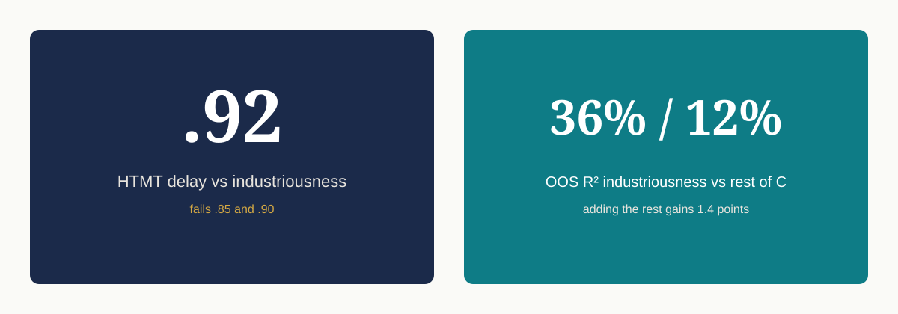
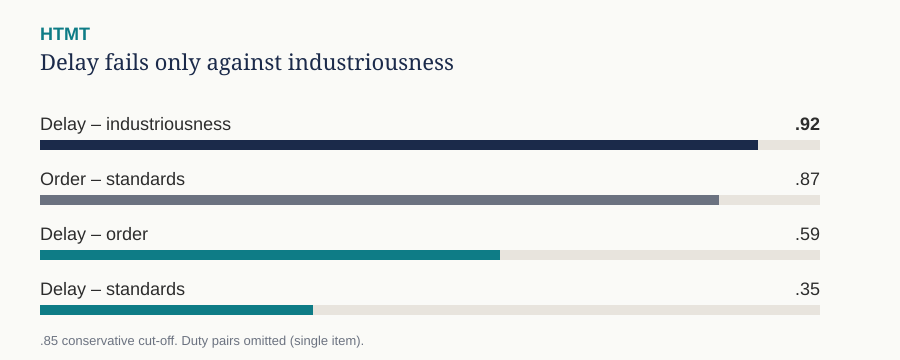

# Inside Industriousness

**Where delay-worded conscientiousness items actually live.**

Independent psychometric study. SAPA 2020. N = 200,149.

[Brief](docs/BRIEF.md) · [Methods](METHODS.md) · [Modelling](MODELING.md) · [Robustness](ROBUSTNESS.md)

---

## Result

Delay-worded conscientiousness items do **not** form a factor apart from industriousness.





| Estimate | r | N |
|---|---:|---:|
| Delay items, mean inter-item r | .46 | pairwise 79k–117k |
| Delay composite vs remaining C items | **.42** | 109,423 |
| Delay composite vs industriousness only | **.57** | 96,175 |
| Promax two-factor phi | -.39 | — |

They load with “I work hard” and “I neglect my duties” under **varimax and promax**. They split from orderliness and from high standards.

Varimax forces uncorrelated factors, which makes separation easier. Finding no separation under that rotation is the conservative result.

## One sentence you can defend

> Inside this conscientiousness item set, delay lives in industriousness.

## One sentence you cannot defend

> I showed that procrastination is just low conscientiousness.

There is **no** Pure Procrastination Scale or Irrational Procrastination Scale in this extract.

## Modelling

Out of sample, industriousness recovers 36% of delay variance; the rest of C recovers 12%; adding it gains 1.4 points. Nested in-sample ΔR² on N = 69,673 is .013.

HTMT delay vs industriousness = .92 (fails .85 and .90). Vs order .59. Vs standards .35. Order vs standards .87.

## Reproduce

```bash
python3 -m pip install -r requirements.txt
python3 analysis/analyze_sapa_delay_items.py
python3 analysis/model_delay_from_facets.py
python3 analysis/robustness_htmt_paf.py
```

Data are not in git. See [data/README.md](data/README.md).
Source: Condon (2024), Harvard Dataverse doi:10.7910/DVN/YOEEDQ.

## Limits

Self-report volunteer sample. Three-item composite. No external outcome. No country field. Exploratory PCA, not confirmatory CFA. Duty is one item; HTMT is not reported for any pair that includes it.

## Licence

Code: MIT. Data: CC0 on the Dataverse deposit.
